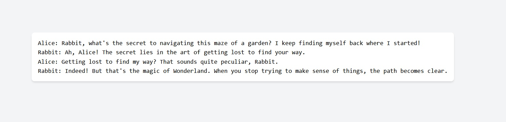

# Alice and Rabbit Chat

This project is a simple chat application where two users, Alice and Rabbit, can send messages to each other. The chat history is saved in the browser's local storage, and a transcript of the chat can be viewed at a separate URL. The project is built using React, TypeScript, Jotai for state management, and Tailwind CSS for styling.

## Getting Started

To run this project on your local machine, follow these steps:

Install the required dependencies:
npm install

Start the development server:
npm start

## Usage

Visit:

-  http://localhost:3000/Alice to access Alice's chat interface.
-  http://localhost:3000/Rabbit to access Rabbit's chat interface.
-  http://localhost:3000/Transcript to view the transcript of the chat between Alice and Rabbit.

Both Alice and Rabbit can send messages, which will appear in their respective chat interfaces. The messages will be saved in the local storage of the browser, so the chat history will be preserved across page refreshes and browser restarts.

## Project Structure

The project is organized into several TypeScript (.tsx) files:

- Alice.tsx: The chat interface for Alice.
- App.tsx: The main application component, which handles routing based on the current URL path.
- ChatApp.tsx: The reusable chat application component, used by both Alice and Rabbit.
- index.tsx: The entry point for the React application.
- messagesAtom.ts: The Jotai atom definition for managing chat messages.
- Rabbit.tsx: The chat interface for Rabbit.
- StaticPage.tsx: A generic component for rendering static content (not used in this project, can be use in the future with Zola, but provided for reference).
- Transcript.tsx: The component that renders the chat transcript as plain text.

## Built With

- [React](https://reactjs.org/)
- [TypeScript](https://www.typescriptlang.org/)
- [Jotai](https://github.com/pmndrs/jotai)
- [Tailwind CSS](https://tailwindcss.com/)

## License

This project is licensed under the [MIT License](LICENSE).
